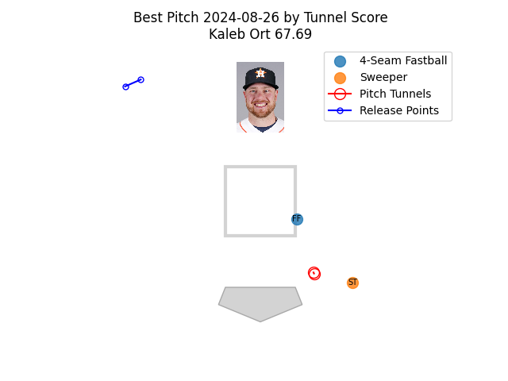

# MLB-Tunnel-Bot

The MLB-Tunnel-Bot is a X bot that finds the best pitch tunneling scores from the day before and tweets about them. You can find the MLB-Tunnel-Bot on X at [this link](https://twitter.com/MLBTunnelBot)

  

## Notes

The `main.py` program is run as a cron job once every day at 3:50:00 PM UTC, which is 11:50:00 AM EST.

### Flags

- `--debug`: run the bot in debug mode (does post tweet, prints it to console & exit program)

### Build Locally

**Python virtual environment**
  (requires [virtualenv package](https://pypi.org/project/virtualenv/))
  1. `virtualenv venv`
  2. `source venv/bin/activate`
  3. `pip3 install -r requirements.txt`
  4. `python3 main.py --debug`

### Roadmap

- [x] run as a cron job
- [ ] web dashboard
- [ ] scrape videos of the best tunneled pitches, overlay them, and tweet the video
