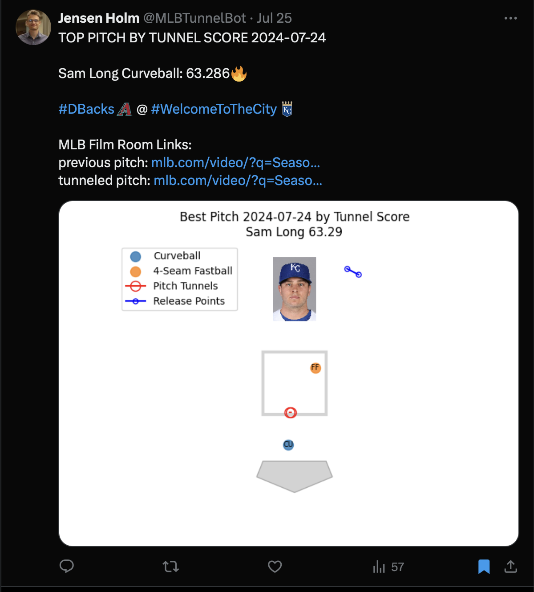

# MLBTunnelBot

The MLB-Tunnel-Bot is a X bot that finds the best pitch tunneling scores from the day before and tweets about them. You can find the MLB-Tunnel-Bot on X at [this link](https://twitter.com/MLBTunnelBot).

## Tunnel Score

### The Math

```math
TunnelScore = \log_2 ((\frac{Pitch Location Distance}{Pitch Tunnel Distance}) - Release Distance)
```

**where:**
  - Pitch Location Distance = euclidien distance between the previous pitchs' location when it crossed the plate, and the current pitch's location when it crossed the plate.
  - Pitch Tunnel Distance = euclidean distance between the previous pitches initial trajectory, and the current pitches initial trajectory.
  - Release Distance = euclidean distance between the previous pitches release point, and the current pitches release point.

Read more about how the tunnel score statistic is calculated [here](https://t.co/R0Haj08fty)

---

### Visual

<div align="center">
  
</div>

This clip is an example of a pitch that has a really good tunnel score. You can see that both pitches start out on the same initial trajectory, and end up in very different places in the strike zone. 

The pitch that has the high tunnel score is the second pitch trown, which in this case is the curveball in the dirt. As you can see, [Sam Long](https://www.baseball-reference.com/players/l/longsa01.shtml) is able to get a swing and miss, likley due in part to tunneling this pitch very well.

The goal of tunnel score is to put a number to this, and reward pitches that 'looked the same' at the start of the pitch as the previous one, and ended up in different places.

This curveball had the highest tunnel score of the day on July 24, 2024.

## Example Tweet

<div align="center">
  
</div>

## Notes

The `main.py` program is run as a cron job once every day at 3:50:00 PM UTC, which is 11:50:00 AM EST. This cron job will tweet the highest tunnel score from the day before.

### Flags

- `--debug`: run the bot in debug mode (does post tweet, prints it to console & exit program)
- `--date`: specify the date to get the tunnel scores for (format: `YYYY-MM-DD`), default is yesterday

### Run Locally

1. `git clone https://github.com/Jensen-holm/MLBTunnelBot && cd MLBTunnelBot`
2. `pip3 install -r requirements.txt`
3. `python3 main.py --debug --date=2024-07-02`

## Roadmap

- [x] Grab statistics from day prior, and compute tunnel score
- [x] Post this information as a tweet on X
- [x] run as a cron job
- [ ] fangraphs community blog article
- [ ] web dashboard
- [ ] scrape videos of the best tunneled pitches, overlay them, and tweet the video
- [ ] study mechanics similarities more in depth than just release position
